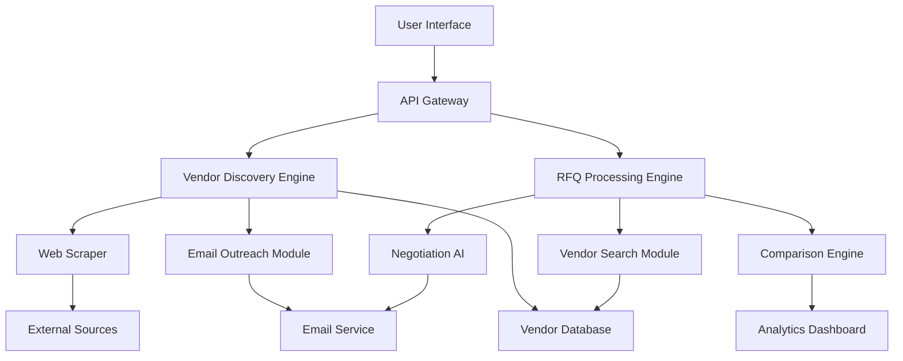

#

# Product Requirements Document (PRD)

## AI-Powered Intelligent Sourcing Platform

---

## 📋 Executive Summary

This document outlines the requirements for an AI-powered procurement and vendor sourcing platform that automates the entire sourcing lifecycle—from vendor discovery and onboarding to RFQ management, price negotiation, and vendor comparison.

---

## 🎯 Product Vision

Build an autonomous sourcing agent that continuously discovers vendors globally, manages relationships through automated communication, and optimizes procurement decisions through intelligent price comparison and vendor evaluation.

---

## 🚀 Core Components

### **Component 1: Intelligent Vendor Discovery Engine**

Continuously operating AI system for vendor identification and onboarding.

### **Component 2: Smart RFQ & Procurement Agent**

On-demand system that handles purchase requests, negotiates prices, and provides optimal vendor recommendations.

---

## 📊 Detailed Requirements

### **1. Intelligent Vendor Discovery Engine**

<details>
<summary><strong>1.1 Vendor Discovery & Research</strong></summary>

### Input Parameters

- Product categories/SKUs list
- Target countries/regions
- Industry specifications
- Minimum vendor criteria (certifications, capacity, etc.)

### Discovery Sources

- **Web Crawling**: Industry directories, B2B marketplaces (Alibaba, Made-in-China, IndiaMART, ThomasNet)
- **Search Engines**: Google, Bing with specialized queries
- **Trade Shows**: Virtual and physical exhibitor databases
- **Government Databases**: Export/import registries, chamber of commerce listings
- **Social Media**: LinkedIn company pages, industry groups
- **Existing Vendor Database**: Internal historical data

### Data Extraction & Enrichment

```python
vendor_profile = {
    "company_name": str,
    "country": str,
    "contact_info": {
        "email": list,
        "phone": list,
        "website": str,
        "address": str
    },
    "products": list,
    "certifications": list,
    "company_size": str,
    "years_in_business": int,
    "export_markets": list,
    "manufacturing_capacity": str,
    "minimum_order_quantity": str,
    "payment_terms": list,
    "lead_time": str,
    "quality_score": float,
    "reliability_score": float
}
```

</details>

<details>
<summary><strong>1.2 Automated Vendor Outreach</strong></summary>

### Email Campaign System

**Initial Introduction Email Template:**

```
Subject: Partnership Opportunity - [Your Company Name]

Dear [Vendor Name],

We are [Company Description] actively seeking reliable suppliers
for [Product Categories] in [Region].

We discovered your company while researching qualified vendors and
are impressed by [specific detail about their business].

Key Points:
✓ Long-term partnership potential
✓ Regular purchase volumes
✓ Competitive payment terms
✓ Growth opportunities

Would you be interested in receiving our RFQs and establishing a
business relationship?

Best regards,
[AI Agent Name/Company]
```

### Follow-up Sequence

1. **Day 0**: Initial introduction
2. **Day 3**: First follow-up if no response
3. **Day 7**: Second follow-up with more details
4. **Day 14**: Final follow-up
5. **After response**: Move to "Active Vendors" database

### Email Personalization Engine

- Extract company-specific achievements from website
- Reference recent news/expansions
- Tailor product categories to their expertise
- Adjust tone based on company size/culture

</details>

<details>
<summary><strong>1.3 Vendor Database Management</strong></summary>

### Database Schema

```sql
-- Vendors Table
CREATE TABLE vendors (
    vendor_id UUID PRIMARY KEY,
    company_name VARCHAR(255),
    status ENUM('discovered', 'contacted', 'active', 'inactive'),
    discovery_date TIMESTAMP,
    last_contact TIMESTAMP,
    response_rate FLOAT,
    performance_score FLOAT,
    -- ... other fields
);

-- Vendor Products
CREATE TABLE vendor_products (
    vendor_id UUID,
    product_category VARCHAR(255),
    specifications JSONB,
    price_range JSONB,
    moq INTEGER,
    -- ... other fields
);

-- Communication History
CREATE TABLE communications (
    comm_id UUID PRIMARY KEY,
    vendor_id UUID,
    type ENUM('email', 'call', 'rfq', 'order'),
    content TEXT,
    timestamp TIMESTAMP,
    response TEXT,
    response_time INTERVAL
);
```

### Vendor Scoring Algorithm

$$
\text{Vendor Score} = w_1 \cdot Q + w_2 \cdot R + w_3 \cdot P + w_4 \cdot C + w_5 \cdot T
$$

Where:

- $Q$ = Quality Score (certifications, reviews, defect rate)
- $R$ = Reliability Score (on-time delivery, communication responsiveness)
- $P$ = Price Competitiveness (compared to market average)
- $C$ = Capacity Score (ability to meet volume requirements)
- $T$ = Trade Terms Score (payment flexibility, warranty)
- $w_i$ = Configurable weights

</details>

---

### **2. Smart RFQ & Procurement Agent**

<details>
<summary><strong>2.1 RFQ Request Processing</strong></summary>

### Input Format

```json
{
  "rfq_id": "RFQ-2024-001",
  "requested_by": "procurement_user_id",
  "products": [
    {
      "product_name": "Steel Pipes",
      "specifications": {
        "diameter": "50mm",
        "length": "6m",
        "material": "ASTM A53 Grade B",
        "coating": "Galvanized"
      },
      "quantity": 10000,
      "unit": "pieces",
      "delivery_location": "Dubai, UAE",
      "required_delivery_date": "2024-06-15"
    }
  ],
  "budget_range": {
    "min": 50000,
    "max": 75000,
    "currency": "USD"
  },
  "priority": "high",
  "quality_requirements": ["ISO 9001", "Mill Test Certificate"],
  "payment_terms_preference": "30 days after delivery"
}
```

</details>

<details>
<summary><strong>2.2 Multi-Source Vendor Search</strong></summary>

### Search Strategy (Parallel Execution)

1. **Internal Database Query**
   - Filter by product category + country
   - Match specifications with historical data
   - Prioritize vendors with good performance scores
2. **Real-time Web Search**

   ```python
   search_queries = [
       f"{product_name} manufacturer {country}",
       f"{product_name} supplier {region}",
       f"buy {product_name} wholesale {country}",
       f"{product_specs} exporter {country}"
   ]
   ```

3. **B2B Marketplace API Integration**
   - Alibaba API
   - ThomasNet API
   - IndiaMART scraping (if no API)
4. **Trade Database Mining**
   - Import/export records
   - Customs data analysis

### Vendor Qualification Filter

```python
def qualify_vendor(vendor, rfq_requirements):
    checks = {
        "can_meet_quantity": vendor.capacity >= rfq.quantity,
        "ships_to_location": rfq.location in vendor.export_markets,
        "has_certifications": all(cert in vendor.certs for cert in rfq.required_certs),
        "meets_delivery_time": vendor.lead_time <= calculate_days(rfq.delivery_date),
        "price_in_budget": vendor.avg_price * 1.2 <= rfq.max_budget  # 20% margin
    }
    return all(checks.values())
```

</details>

<details>
<summary><strong>2.3 Automated RFQ Distribution</strong></summary>

### RFQ Email Template

```
Subject: RFQ #[ID] - [Product Name] - [Quantity] Units

Dear [Vendor Name],

We are requesting a quotation for the following:

PRODUCT DETAILS
━━━━━━━━━━━━━━━━━━━━━━━━━━━
Product: [Product Name]
Quantity: [Number] [Units]
Specifications:
  • [Spec 1]
  • [Spec 2]
  • [Spec 3]

DELIVERY REQUIREMENTS
━━━━━━━━━━━━━━━━━━━━━━━━━━━
Location: [City, Country]
Required Date: [Date]
Incoterms: [FOB/CIF/etc.]

QUOTE REQUIREMENTS
━━━━━━━━━━━━━━━━━━━━━━━━━━━
Please provide:
1. Unit price (USD)
2. Total price including shipping
3. Lead time
4. Payment terms
5. Certifications/quality documents
6. Samples (if applicable)

Deadline for submission: [Date + 3 days]

Please submit your quote via [portal link] or reply to this email.

Best regards,
[Company] Procurement Team
```

### Tracking System

- Email delivery confirmation
- Open/read tracking
- Response deadline monitoring
- Auto-reminders 24 hours before deadline

</details>

<details>
<summary><strong>2.4 AI-Powered Price Negotiation</strong></summary>

### Negotiation Strategy Engine

**Phase 1: Initial Quote Analysis**

```python
def analyze_quotes(quotes):
    statistics = {
        "mean_price": np.mean([q.price for q in quotes]),
        "median_price": np.median([q.price for q in quotes]),
        "std_dev": np.std([q.price for q in quotes]),
        "lowest_price": min([q.price for q in quotes]),
        "market_benchmark": get_market_price(product)
    }

    # Identify negotiation targets
    negotiable_vendors = [
        v for v in quotes
        if v.price > statistics["lowest_price"] * 1.1  # 10% above lowest
        and v.overall_score > 7.0  # Good quality/reliability
    ]
    return negotiable_vendors
```

**Phase 2: Negotiation Tactics**

| Scenario                   | Tactic                          | Example Message                                                                                        |
| -------------------------- | ------------------------------- | ------------------------------------------------------------------------------------------------------ |
| Price > 20% above lowest   | **Direct Competitive Pressure** | "We have received quotes as low as $X. Can you match or improve this price while maintaining quality?" |
| Price 10-20% above lowest  | **Volume Leverage**             | "We're placing regular orders. If you reduce to $X, we can commit to quarterly orders."                |
| Good vendor, slightly high | **Long-term Partnership**       | "Your quality is excellent. At $X price point, we can establish a preferred vendor agreement."         |
| All quotes above budget    | **Bundle Negotiation**          | "Can we optimize specifications or adjust delivery schedule to meet our budget?"                       |

**Phase 3: Counter-Offer Algorithm**

$$
\text{Counter Price} = \text{Lowest Quote} + (\text{Vendor Score} - 5) \times 0.02 \times \text{Lowest Quote}
$$

**Phase 4: Automated Negotiation Rounds**

1. **Round 1**: Send counter-offers based on competitive analysis
2. **Round 2**: Adjust based on responses (if still above target)
3. **Round 3**: Final offer with clear deadline
4. **Escalation**: Flag for human review if no agreement

</details>

<details>
<summary><strong>2.5 Vendor Comparison & Ranking</strong></summary>

### Multi-Criteria Decision Matrix

```python
comparison_criteria = {
    "price": {
        "weight": 0.35,
        "type": "minimize",
        "formula": lambda x: (max_price - x) / (max_price - min_price)
    },
    "quality_score": {
        "weight": 0.25,
        "type": "maximize",
        "formula": lambda x: x / 10
    },
    "delivery_time": {
        "weight": 0.15,
        "type": "minimize",
        "formula": lambda x: (max_time - x) / (max_time - min_time)
    },
    "reliability": {
        "weight": 0.15,
        "type": "maximize",
        "formula": lambda x: x / 10
    },
    "payment_terms": {
        "weight": 0.10,
        "type": "maximize",
        "formula": lambda x: x / 90  # days credit
    }
}

def calculate_final_score(vendor):
    total = 0
    for criterion, config in comparison_criteria.items():
        normalized = config["formula"](vendor[criterion])
        weighted = normalized * config["weight"]
        total += weighted
    return total * 100  # Scale to 0-100
```

### Comparison Table Output

| Rank | Vendor             | Price (USD) | Quality | Delivery | Reliability | Payment Terms | Final Score | Recommendation     |
| ---- | ------------------ | ----------- | ------- | -------- | ----------- | ------------- | ----------- | ------------------ |
| 1    | ABC Steel Co.      | $125,000    | 9.2/10  | 25 days  | 9.5/10      | 45 days       | **92.3**    | ⭐ **Best Choice** |
| 2    | XYZ Metals         | $118,000    | 8.5/10  | 30 days  | 8.8/10      | 30 days       | **88.7**    | Good Alternative   |
| 3    | Global Pipes Ltd   | $132,000    | 9.8/10  | 20 days  | 9.2/10      | 60 days       | **87.5**    | Best Quality       |
| 4    | FastTrack Supplies | $115,000    | 7.5/10  | 35 days  | 7.0/10      | 15 days       | **79.2**    | Lowest Price       |

### Risk Analysis

```python
risk_factors = {
    "single_source_dependency": check_if_only_vendor_in_region(),
    "price_volatility": analyze_historical_price_variance(),
    "geopolitical_risk": assess_country_risk_score(),
    "capacity_constraints": vendor.max_capacity < rfq.quantity * 3,
    "new_vendor_risk": vendor.relationship_duration < 6_months
}
```

</details>

---

## 🔧 Technical Architecture

### **System Components**



### **Technology Stack**

| Layer             | Technologies                                                              |
| ----------------- | ------------------------------------------------------------------------- |
| **Frontend**      | React.js, TypeScript, TailwindCSS, Recharts                               |
| **Backend**       | Python (FastAPI), Node.js (for real-time features)                        |
| **AI/ML**         | OpenAI GPT-4 (negotiation, email generation), LangChain, Custom ML models |
| **Web Scraping**  | Scrapy, Selenium, Puppeteer, Bright Data proxies                          |
| **Database**      | PostgreSQL (vendors), MongoDB (scraped data), Redis (cache)               |
| **Search**        | Elasticsearch (vendor search), Apache Solr                                |
| **Email**         | SendGrid API, custom SMTP, Email tracking (PostMark)                      |
| **Queue/Workers** | Celery, RabbitMQ                                                          |
| **Monitoring**    | Prometheus, Grafana, Sentry                                               |

---

## 🔐 Security & Compliance

<details>
<summary><strong>Data Protection</strong></summary>

- **Encryption**: AES-256 for data at rest, TLS 1.3 for data in transit
- **Authentication**: OAuth 2.0, JWT tokens, MFA for admin access
- **Access Control**: RBAC (Role-Based Access Control)
- **Vendor Data Privacy**: GDPR/CCPA compliant data handling
- **API Security**: Rate limiting, API key rotation, webhook signatures

</details>

<details>
<summary><strong>Procurement Compliance</strong></summary>

- Audit trail for all negotiations and decisions
- Vendor verification and due diligence logs
- Conflict of interest detection
- Anti-corruption compliance checks
- Export/import regulation validation

</details>

---

## 📈 Success Metrics (KPIs)

### **Vendor Discovery Engine**

- New vendors discovered per week: **Target: 50+**
- Email response rate: **Target: 15-20%**
- Vendor database growth: **Target: 500+ vendors/month**
- Data accuracy rate: **Target: 95%+**

### **RFQ System**

- Average time to complete RFQ cycle: **Target: < 3 days**
- Number of quotes per RFQ: **Target: 8-12**
- Negotiation success rate (price reduction): **Target: 15-25%**
- Cost savings vs. manual process: **Target: 30%+**
- User satisfaction score: **Target: 4.5/5**

### **System Performance**

- Vendor search latency: **< 5 seconds**
- Email delivery success rate: **> 98%**
- AI negotiation accuracy: **> 85%**
- Platform uptime: **99.9%**

---

## 🗓️ Development Phases

### **Phase 1: MVP (Months 1-3)**

- ✅ Basic vendor database
- ✅ Manual RFQ creation and distribution
- ✅ Simple vendor comparison table
- ✅ Email tracking

### **Phase 2: Automation (Months 4-6)**

- ✅ Web scraping engine
- ✅ Automated vendor discovery
- ✅ AI-powered email generation
- ✅ Basic negotiation templates

### **Phase 3: Intelligence (Months 7-9)**

- ✅ AI negotiation agent
- ✅ Advanced scoring algorithms
- ✅ Predictive analytics
- ✅ Market price intelligence

### **Phase 4: Scale (Months 10-12)**

- ✅ Multi-language support
- ✅ API marketplace integrations
- ✅ Advanced analytics dashboard
- ✅ Mobile app

---

## 🎨 User Interface Mockups

### **Dashboard View**

```
┌─────────────────────────────────────────────────────────────┐
│  🏠 Dashboard  |  📋 RFQs  |  🏢 Vendors  |  📊 Analytics   │
├─────────────────────────────────────────────────────────────┤
│                                                              │
│  📈 Key Metrics                                              │
│  ┌──────────────┬──────────────┬──────────────┬───────────┐ │
│  │ Active RFQs  │ New Vendors  │ Avg Savings  │ Response  │ │
│  │     23       │     142      │    22.5%     │   Rate    │ │
│  │              │   this week  │              │   18.2%   │ │
│  └──────────────┴──────────────┴──────────────┴───────────┘ │
│                                                              │
│  🔍 Vendor Discovery Status                                  │
│  [████████████████──────────] 67% Complete                   │
│  Discovered: 245 vendors | Contacted: 198 | Active: 87      │
│                                                              │
│  📌 Recent RFQs                                              │
│  ┌────────────────────────────────────────────────────────┐ │
│  │ RFQ-2024-045 | Steel Pipes | 12 quotes | ⏱️ Negotiating│ │
│  │ RFQ-2024-044 | Electronics | 8 quotes  | ✅ Completed  │ │
│  │ RFQ-2024-043 | Packaging   | 5 quotes  | 📊 Comparing  │ │
│  └────────────────────────────────────────────────────────┘ │
└─────────────────────────────────────────────────────────────┘
```

### **Vendor Comparison View**

```
┌─────────────────────────────────────────────────────────────┐
│  RFQ-2024-045: Steel Pipes (10,000 units)                    │
├─────────────────────────────────────────────────────────────┤
│  📊 Vendor Comparison                     🔽 Export CSV      │
│                                                              │
│  [Price] [Quality] [Delivery] [Reliability] [All Factors]   │
│                                                              │
│  ⭐ RECOMMENDED                                              │
│  ┌────────────────────────────────────────────────────────┐ │
│  │ 🏆 ABC Steel Co.                    Score: 92.3/100    │ │
│  │ 📍 China | 💰 $125,000 | 📦 25 days | ⭐ 9.2/10        │ │
│  │ ✅ ISO 9001 | ✅ Mill Cert | 💳 45 days payment        │ │
│  │ [View Details] [Select] [Negotiate Further]            │ │
│  └────────────────────────────────────────────────────────┘ │
│                                                              │
│  ALTERNATIVES                                                │
│  ┌────────────────────────────────────────────────────────┐ │
│  │ XYZ Metals                          Score: 88.7/100    │ │
│  │ 📍 India | 💰 $118,000 | 📦 30 days | ⭐ 8.5/10       │ │
│  └────────────────────────────────────────────────────────┘ │
│                                                              │
│  ┌────────────────────────────────────────────────────────┐ │
│  │ Global Pipes Ltd                    Score: 87.5/100    │ │
│  │ 📍 UAE | 💰 $132,000 | 📦 20 days | ⭐ 9.8/10         │ │
│  │ 💎 BEST QUALITY                                        │ │
│  └────────────────────────────────────────────────────────┘ │
└─────────────────────────────────────────────────────────────┘
```

---

## 🚨 Risk Mitigation

| Risk                        | Impact | Mitigation Strategy                                             |
| --------------------------- | ------ | --------------------------------------------------------------- |
| Low vendor response rates   | High   | Multi-channel outreach, incentives, follow-up automation        |
| Inaccurate vendor data      | Medium | Data validation AI, manual review for critical vendors          |
| AI negotiation failures     | Medium | Human-in-the-loop for high-value RFQs, learning from mistakes   |
| Email deliverability issues | High   | Multi-provider setup, domain reputation management              |
| Scraping detection/blocking | Medium | Rotating proxies, respectful crawling, API usage where possible |
| Vendor trust/skepticism     | Medium | Clear branding, human override option, build reputation         |

---

## 💡 Future Enhancements

1. **Blockchain Integration**: Smart contracts for automated payments and compliance
2. **Predictive Demand Planning**: AI forecasts to proactively source before requests
3. **Supplier Sustainability Scoring**: ESG metrics integration
4. **AR/VR Showrooms**: Virtual vendor facility tours
5. **Voice Interface**: Voice-activated RFQ creation
6. **Marketplace Mode**: Allow vendors to list products proactively
7. **Collaborative Procurement**: Multi-company buying consortiums

---

## 📚 Appendix

### **Glossary**

- **RFQ**: Request for Quotation
- **MOQ**: Minimum Order Quantity
- **Incoterms**: International Commercial Terms (shipping responsibility)
- **Lead Time**: Time from order to delivery
- **FOB/CIF**: Freight payment terms

### **API Documentation**

Available at: `/docs/api/v1`

### **Training Materials**

- User guide: `/docs/user-guide.pdf`
- Video tutorials: `/resources/videos`
- Onboarding checklist: `/docs/onboarding.md`

---

**Document Version**: 1.0

**Last Updated**: 2024

**Owner**: Product Management Team

**Review Cycle**: Quarterly
